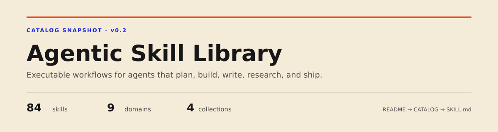
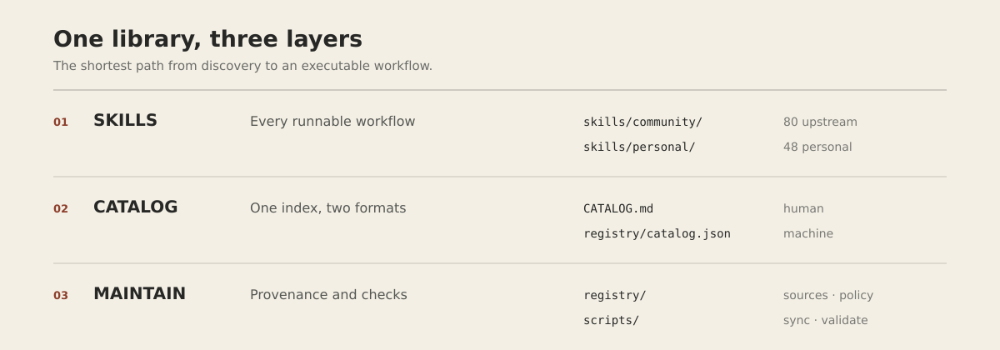
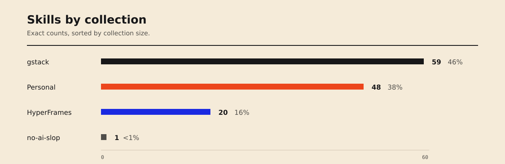

<p align="center">
  
</p>

<p align="center">
  <a href="CATALOG.md"></a>
  <a href="CATALOG.md"></a>
  <a href="skills/personal/README.md"></a>
  <a href="SOURCES.md"></a>
  <a href="https://github.com/mannyandrs45/agentic-skill-library/actions/workflows/validate.yml"></a>
</p>

<p align="center">
  A curated library of executable agent workflows. Browse a skill, inspect its decisions and guardrails, then adapt it to your harness.
</p>

## Pick a path

| I want to… | Start here |
| --- | --- |
| Find the right workflow | **[Browse all 128 skills →](CATALOG.md)** |
| Study complete agent systems | **[Explore community collections →](skills/community/)** |
| Reuse Manny's Computer skills | **[Open personal skills →](skills/personal/README.md)** |
| Port a skill to another agent | **[Read the portability guide →](docs/PORTABILITY.md)** |
| Add or update a skill | **[Read the contribution guide →](CONTRIBUTING.md)** |

## One library, three layers

<p align="center">
  
</p>

Everything runnable lives in `skills/`. Everything discoverable is generated into `CATALOG.md`. Everything needed to keep the library trustworthy lives in `registry/` and `scripts/`.

```text
skills/
├── community/          # Attributed upstream systems
│   ├── gstack/
│   ├── hyperframes/
│   └── no-ai-slop/
└── personal/           # Publication-safe Perplexity Computer skills

CATALOG.md              # The only index
registry/               # Provenance and machine metadata
scripts/                # Import, sync, catalog, validate
```

That is the whole architecture. There is no parallel vault, second atlas, or duplicate navigation hierarchy.

## What is inside

<p align="center">
  
</p>

| Collection | Skills | Best for |
| --- | ---: | --- |
| **[gstack](skills/community/gstack/README.md)** | 59 | Product thinking, engineering, QA, release, browser work, and long-running agent operations |
| **[Personal](skills/personal/README.md)** | 48 | Marketing, travel, writing, sports intelligence, visualization, and Perplexity Computer workflows |
| **[HyperFrames](skills/community/hyperframes/README.md)** | 20 | Video, motion, audio, captions, and media production |
| **[no-ai-slop](skills/community/no-ai-slop/README.md)** | 1 | Detecting and removing synthetic writing patterns without flattening voice |

## What counts as a skill

A skill is an executable operating procedure, not a persona or a bag of tips. Strong entries make six things clear:

1. **Trigger:** when the skill runs, and when it should not.
2. **Inputs:** what context it needs before acting.
3. **Workflow:** the sequence and decision branches.
4. **Tools:** what it may use and where confirmation is required.
5. **Output:** the artifact or action it must produce.
6. **Verification:** how the agent knows the work is done.

## Use the library

```bash
git clone https://github.com/mannyandrs45/agentic-skill-library.git
cd agentic-skill-library

npm run validate
npm run sync:upstreams
npm run import:perplexity -- /path/to/exported/user/skills
```

`sync:upstreams` refreshes pinned community snapshots. `import:perplexity` imports only the publication-safe allowlist, so private Springs Labs operating playbooks remain reference-only.

## Principles

- **Useful over numerous.** Every skill should change agent behavior.
- **Source stays visible.** Community work keeps its license and exact commit.
- **One front door.** The README explains; the catalog indexes.
- **Portable by design.** Workflow invariants stay separate from harness-specific tools.
- **Private means private.** Client data, credentials, and sensitive operating rules never enter the published tree.

<p align="center">
  <strong>Start with the <a href="CATALOG.md">skill catalog</a>.</strong>
</p>
