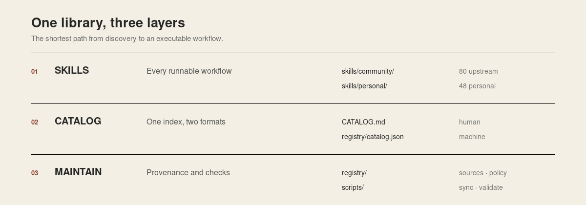

# Architecture

The repository has one job: make strong agent skills easy to inspect, find, and maintain. It uses three layers.

## Skills

Every runnable workflow lives under one tree:

- `skills/community/` contains pinned, attributed upstream systems.
- `skills/personal/` contains publication-safe, user-owned skills exported from Perplexity Computer.

Imported projects keep their internal structure because references, scripts, and templates can be part of runtime behavior.

## Catalog

`CATALOG.md` is the only human index. `registry/catalog.json` is the same index for machines. Both are generated from `SKILL.md` manifests.

## Maintenance

- `registry/` records source commits, licenses, and publication policy.
- `scripts/` imports personal skills, refreshes community snapshots, rebuilds the catalog, and validates links and provenance.
- `.github/workflows/validate.yml` runs the same validation on every change.

There is no separate vault or second navigation hierarchy. The README is the landing page, the catalog is the index, and the skill tree is the library.

## Why snapshots instead of submodules

Pinned snapshots keep the repository self-contained and searchable. Exact upstream commits preserve reproducibility, while the sync script keeps updates deliberate.
