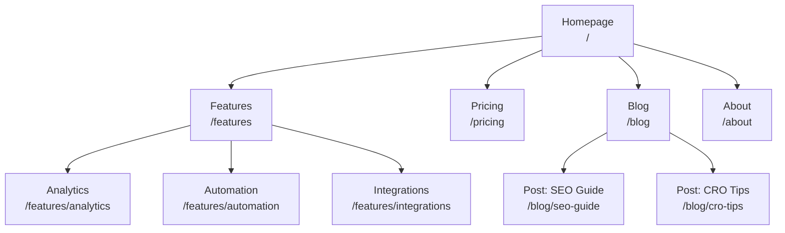
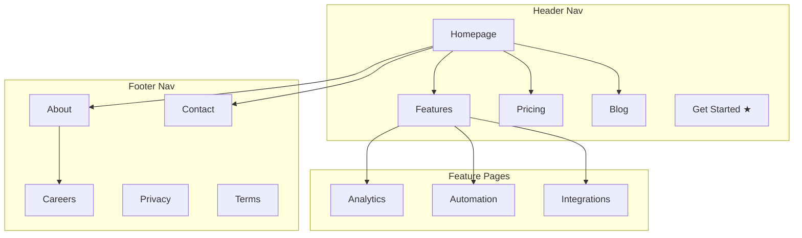
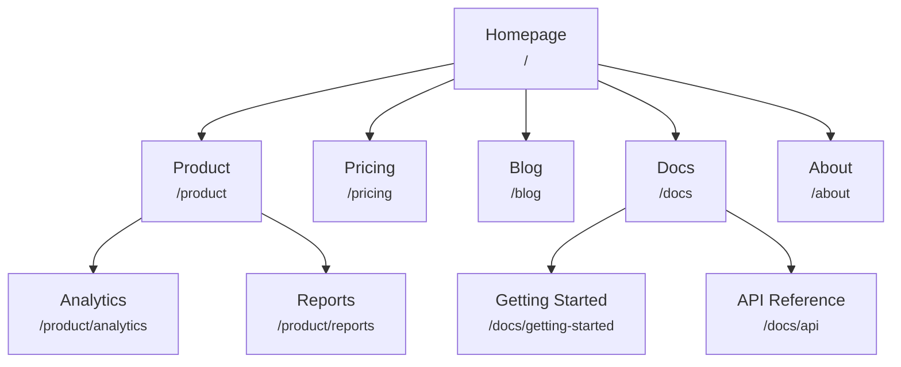
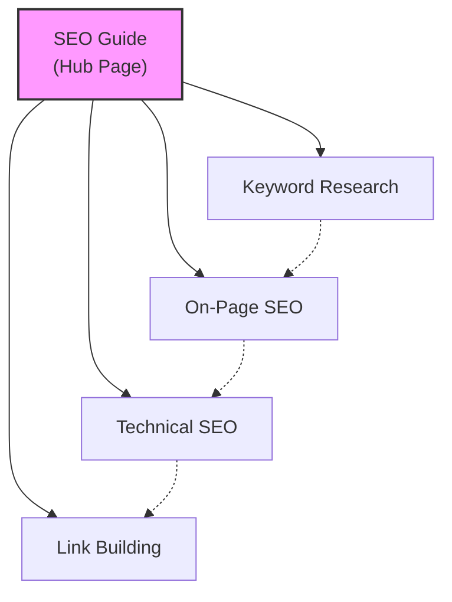
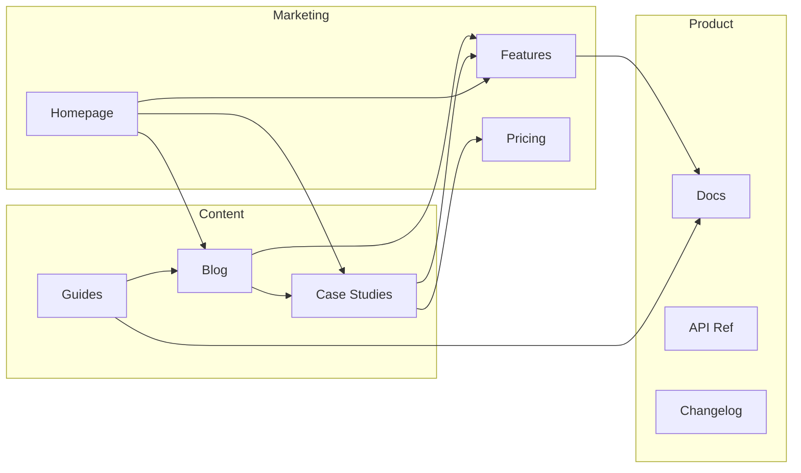
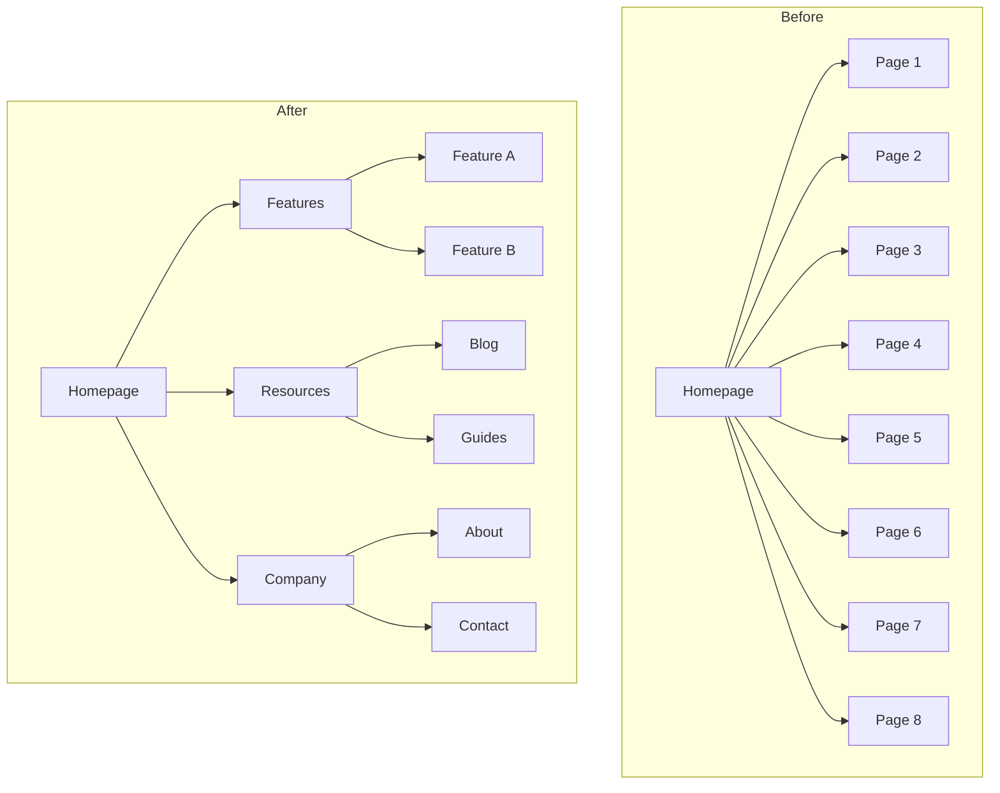
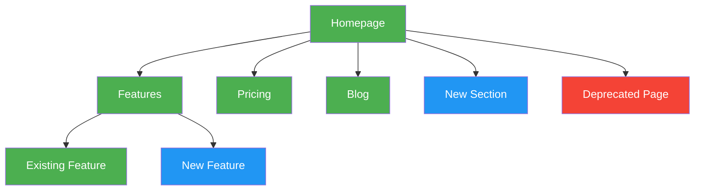

# SEO & Discovery — Reference Materials

Consolidated reference documentation for the seo & discovery skills.
Source: [coreyhaines31/marketingskills](https://github.com/coreyhaines31/marketingskills)

---

## seo-audit — Ai Writing Detection

<!-- Source: skills/seo-audit/references/ai-writing-detection.md -->

# AI Writing Detection

Words, phrases, and punctuation patterns commonly associated with AI-generated text. Avoid these to ensure writing sounds natural and human.

Sources: Grammarly (2025), Microsoft 365 Life Hacks (2025), GPTHuman (2025), Walter Writes (2025), Textero (2025), Plagiarism Today (2025), Rolling Stone (2025), MDPI Blog (2025)

---

## Contents
- Em Dashes: The Primary AI Tell
- Overused Verbs
- Overused Adjectives
- Overused Transitions and Connectors
- Phrases That Signal AI Writing (Opening Phrases, Transitional Phrases, Concluding Phrases, Structural Patterns)
- Filler Words and Empty Intensifiers
- Academic-Specific AI Tells
- How to Self-Check

## Em Dashes: The Primary AI Tell

**The em dash (—) has become one of the most reliable markers of AI-generated content.**

Em dashes are longer than hyphens (-) and are used for emphasis, interruptions, or parenthetical information. While they have legitimate uses in writing, AI models drastically overuse them.

### Why Em Dashes Signal AI Writing
- AI models were trained on edited books, academic papers, and style guides where em dashes appear frequently
- AI uses em dashes as a shortcut for sentence variety instead of commas, colons, or parentheses
- Most human writers rarely use em dashes because they don't exist as a standard keyboard key
- The overuse is so consistent that it has become the unofficial signature of ChatGPT writing

### What To Do Instead
| Instead of | Use |
|------------|-----|
| The results—which were surprising—showed... | The results, which were surprising, showed... |
| This approach—unlike traditional methods—allows... | This approach, unlike traditional methods, allows... |
| The study found—as expected—that... | The study found, as expected, that... |
| Communication skills—both written and verbal—are essential | Communication skills (both written and verbal) are essential |

### Guidelines
- Use commas for most parenthetical information
- Use colons to introduce explanations or lists
- Use parentheses for supplementary information
- Reserve em dashes for rare, deliberate emphasis only
- If you find yourself using more than one em dash per page, revise

---

## Overused Verbs

| Avoid | Use Instead |
|-------|-------------|
| delve (into) | explore, examine, investigate, look at |
| leverage | use, apply, draw on |
| optimise | improve, refine, enhance |
| utilise | use |
| facilitate | help, enable, support |
| foster | encourage, support, develop, nurture |
| bolster | strengthen, support, reinforce |
| underscore | emphasise, highlight, stress |
| unveil | reveal, show, introduce, present |
| navigate | manage, handle, work through |
| streamline | simplify, make more efficient |
| enhance | improve, strengthen |
| endeavour | try, attempt, effort |
| ascertain | find out, determine, establish |
| elucidate | explain, clarify, make clear |

---

## Overused Adjectives

| Avoid | Use Instead |
|-------|-------------|
| robust | strong, reliable, thorough, solid |
| comprehensive | complete, thorough, full, detailed |
| pivotal | key, critical, central, important |
| crucial | important, key, essential, critical |
| vital | important, essential, necessary |
| transformative | significant, important, major |
| cutting-edge | new, advanced, recent, modern |
| groundbreaking | new, original, significant |
| innovative | new, original, creative |
| seamless | smooth, easy, effortless |
| intricate | complex, detailed, complicated |
| nuanced | subtle, complex, detailed |
| multifaceted | complex, varied, diverse |
| holistic | complete, whole, comprehensive |

---

## Overused Transitions and Connectors

| Avoid | Use Instead |
|-------|-------------|
| furthermore | also, in addition, and |
| moreover | also, and, besides |
| notwithstanding | despite, even so, still |
| that being said | however, but, still |
| at its core | essentially, fundamentally, basically |
| to put it simply | in short, simply put |
| it is worth noting that | note that, importantly |
| in the realm of | in, within, regarding |
| in the landscape of | in, within |
| in today's [anything] | currently, now, today |

---

## Phrases That Signal AI Writing

### Opening Phrases to Avoid
- "In today's fast-paced world..."
- "In today's digital age..."
- "In an era of..."
- "In the ever-evolving landscape of..."
- "In the realm of..."
- "It's important to note that..."
- "Let's delve into..."
- "Imagine a world where..."

### Transitional Phrases to Avoid
- "That being said..."
- "With that in mind..."
- "It's worth mentioning that..."
- "At its core..."
- "To put it simply..."
- "In essence..."
- "This begs the question..."

### Concluding Phrases to Avoid
- "In conclusion..."
- "To sum up..."
- "By [doing X], you can [achieve Y]..."
- "In the final analysis..."
- "All things considered..."
- "At the end of the day..."

### Structural Patterns to Avoid
- "Whether you're a [X], [Y], or [Z]..." (listing three examples after "whether")
- "It's not just [X], it's also [Y]..."
- "Think of [X] as [elaborate metaphor]..."
- Starting sentences with "By" followed by a gerund: "By understanding X, you can Y..."

---

## Filler Words and Empty Intensifiers

These words often add nothing to meaning. Remove them or find specific alternatives:

- absolutely
- actually
- basically
- certainly
- clearly
- definitely
- essentially
- extremely
- fundamentally
- incredibly
- interestingly
- naturally
- obviously
- quite
- really
- significantly
- simply
- surely
- truly
- ultimately
- undoubtedly
- very

---

## Academic-Specific AI Tells

| Avoid | Use Instead |
|-------|-------------|
| shed light on | clarify, explain, reveal |
| pave the way for | enable, allow, make possible |
| a myriad of | many, numerous, various |
| a plethora of | many, numerous, several |
| paramount | very important, essential, critical |
| pertaining to | about, regarding, concerning |
| prior to | before |
| subsequent to | after |
| in light of | because of, given, considering |
| with respect to | about, regarding, for |
| in terms of | regarding, for, about |
| the fact that | that (or rewrite sentence) |

---

## How to Self-Check

1. Read your text aloud. If phrases sound unnatural in speech, revise them
2. Ask: "Would I say this in a conversation with a colleague?"
3. Check for repetitive sentence structures
4. Look for clusters of the words listed above
5. Ensure varied sentence lengths (not all similar length)
6. Verify each intensifier adds genuine meaning

---

## ai-seo — Content Patterns

<!-- Source: skills/ai-seo/references/content-patterns.md -->

# AEO and GEO Content Patterns

Reusable content block patterns optimized for answer engines and AI citation.

---

## Contents
- Answer Engine Optimization (AEO) Patterns (Definition Block, Step-by-Step Block, Comparison Table Block, Pros and Cons Block, FAQ Block, Listicle Block)
- Generative Engine Optimization (GEO) Patterns (Statistic Citation Block, Expert Quote Block, Authoritative Claim Block, Self-Contained Answer Block, Evidence Sandwich Block)
- Domain-Specific GEO Tactics (Technology Content, Health/Medical Content, Financial Content, Legal Content, Business/Marketing Content)
- Voice Search Optimization (Question Formats for Voice, Voice-Optimized Answer Structure)

## Answer Engine Optimization (AEO) Patterns

These patterns help content appear in featured snippets, AI Overviews, voice search results, and answer boxes.

### Definition Block

Use for "What is [X]?" queries.

```markdown
## What is [Term]?

[Term] is [concise 1-sentence definition]. [Expanded 1-2 sentence explanation with key characteristics]. [Brief context on why it matters or how it's used].
```

**Example:**
```markdown
## What is Answer Engine Optimization?

Answer Engine Optimization (AEO) is the practice of structuring content so AI-powered systems can easily extract and present it as direct answers to user queries. Unlike traditional SEO that focuses on ranking in search results, AEO optimizes for featured snippets, AI Overviews, and voice assistant responses. This approach has become essential as over 60% of Google searches now end without a click.
```

### Step-by-Step Block

Use for "How to [X]" queries. Optimal for list snippets.

```markdown
## How to [Action/Goal]

[1-sentence overview of the process]

1. **[Step Name]**: [Clear action description in 1-2 sentences]
2. **[Step Name]**: [Clear action description in 1-2 sentences]
3. **[Step Name]**: [Clear action description in 1-2 sentences]
4. **[Step Name]**: [Clear action description in 1-2 sentences]
5. **[Step Name]**: [Clear action description in 1-2 sentences]

[Optional: Brief note on expected outcome or time estimate]
```

**Example:**
```markdown
## How to Optimize Content for Featured Snippets

Earning featured snippets requires strategic formatting and direct answers to search queries.

1. **Identify snippet opportunities**: Use tools like Semrush or Ahrefs to find keywords where competitors have snippets you could capture.
2. **Match the snippet format**: Analyze whether the current snippet is a paragraph, list, or table, and format your content accordingly.
3. **Answer the question directly**: Provide a clear, concise answer (40-60 words for paragraph snippets) immediately after the question heading.
4. **Add supporting context**: Expand on your answer with examples, data, and expert insights in the following paragraphs.
5. **Use proper heading structure**: Place your target question as an H2 or H3, with the answer immediately following.

Most featured snippets appear within 2-4 weeks of publishing well-optimized content.
```

### Comparison Table Block

Use for "[X] vs [Y]" queries. Optimal for table snippets.

```markdown
## [Option A] vs [Option B]: [Brief Descriptor]

| Feature | [Option A] | [Option B] |
|---------|------------|------------|
| [Criteria 1] | [Value/Description] | [Value/Description] |
| [Criteria 2] | [Value/Description] | [Value/Description] |
| [Criteria 3] | [Value/Description] | [Value/Description] |
| [Criteria 4] | [Value/Description] | [Value/Description] |
| Best For | [Use case] | [Use case] |

**Bottom line**: [1-2 sentence recommendation based on different needs]
```

### Pros and Cons Block

Use for evaluation queries: "Is [X] worth it?", "Should I [X]?"

```markdown
## Advantages and Disadvantages of [Topic]

[1-sentence overview of the evaluation context]

### Pros

- **[Benefit category]**: [Specific explanation]
- **[Benefit category]**: [Specific explanation]
- **[Benefit category]**: [Specific explanation]

### Cons

- **[Drawback category]**: [Specific explanation]
- **[Drawback category]**: [Specific explanation]
- **[Drawback category]**: [Specific explanation]

**Verdict**: [1-2 sentence balanced conclusion with recommendation]
```

### FAQ Block

Use for topic pages with multiple common questions. Essential for FAQ schema.

```markdown
## Frequently Asked Questions

### [Question phrased exactly as users search]?

[Direct answer in first sentence]. [Supporting context in 2-3 additional sentences].

### [Question phrased exactly as users search]?

[Direct answer in first sentence]. [Supporting context in 2-3 additional sentences].

### [Question phrased exactly as users search]?

[Direct answer in first sentence]. [Supporting context in 2-3 additional sentences].
```

**Tips for FAQ questions:**
- Use natural question phrasing ("How do I..." not "How does one...")
- Include question words: what, how, why, when, where, who, which
- Match "People Also Ask" queries from search results
- Keep answers between 50-100 words

### Listicle Block

Use for "Best [X]", "Top [X]", "[Number] ways to [X]" queries.

```markdown
## [Number] Best [Items] for [Goal/Purpose]

[1-2 sentence intro establishing context and selection criteria]

### 1. [Item Name]

[Why it's included in 2-3 sentences with specific benefits]

### 2. [Item Name]

[Why it's included in 2-3 sentences with specific benefits]

### 3. [Item Name]

[Why it's included in 2-3 sentences with specific benefits]
```

---

## Generative Engine Optimization (GEO) Patterns

These patterns optimize content for citation by AI assistants like ChatGPT, Claude, Perplexity, and Gemini.

### Statistic Citation Block

Statistics increase AI citation rates by 15-30%. Always include sources.

```markdown
[Claim statement]. According to [Source/Organization], [specific statistic with number and timeframe]. [Context for why this matters].
```

**Example:**
```markdown
Mobile optimization is no longer optional for SEO success. According to Google's 2024 Core Web Vitals report, 70% of web traffic now comes from mobile devices, and pages failing mobile usability standards see 24% higher bounce rates. This makes mobile-first indexing a critical ranking factor.
```

### Expert Quote Block

Named expert attribution adds credibility and increases citation likelihood.

```markdown
"[Direct quote from expert]," says [Expert Name], [Title/Role] at [Organization]. [1 sentence of context or interpretation].
```

**Example:**
```markdown
"The shift from keyword-driven search to intent-driven discovery represents the most significant change in SEO since mobile-first indexing," says Rand Fishkin, Co-founder of SparkToro. This perspective highlights why content strategies must evolve beyond traditional keyword optimization.
```

### Authoritative Claim Block

Structure claims for easy AI extraction with clear attribution.

```markdown
[Topic] [verb: is/has/requires/involves] [clear, specific claim]. [Source] [confirms/reports/found] that [supporting evidence]. This [explains/means/suggests] [implication or action].
```

**Example:**
```markdown
E-E-A-T is the cornerstone of Google's content quality evaluation. Google's Search Quality Rater Guidelines confirm that trust is the most critical factor, stating that "untrustworthy pages have low E-E-A-T no matter how experienced, expert, or authoritative they may seem." This means content creators must prioritize transparency and accuracy above all other optimization tactics.
```

### Self-Contained Answer Block

Create quotable, standalone statements that AI can extract directly.

```markdown
**[Topic/Question]**: [Complete, self-contained answer that makes sense without additional context. Include specific details, numbers, or examples in 2-3 sentences.]
```

**Example:**
```markdown
**Ideal blog post length for SEO**: The optimal length for SEO blog posts is 1,500-2,500 words for competitive topics. This range allows comprehensive topic coverage while maintaining reader engagement. HubSpot research shows long-form content earns 77% more backlinks than short articles, directly impacting search rankings.
```

### Evidence Sandwich Block

Structure claims with evidence for maximum credibility.

```markdown
[Opening claim statement].

Evidence supporting this includes:
- [Data point 1 with source]
- [Data point 2 with source]
- [Data point 3 with source]

[Concluding statement connecting evidence to actionable insight].
```

---

## Domain-Specific GEO Tactics

Different content domains benefit from different authority signals.

### Technology Content
- Emphasize technical precision and correct terminology
- Include version numbers and dates for software/tools
- Reference official documentation
- Add code examples where relevant

### Health/Medical Content
- Cite peer-reviewed studies with publication details
- Include expert credentials (MD, RN, etc.)
- Note study limitations and context
- Add "last reviewed" dates

### Financial Content
- Reference regulatory bodies (SEC, FTC, etc.)
- Include specific numbers with timeframes
- Note that information is educational, not advice
- Cite recognized financial institutions

### Legal Content
- Cite specific laws, statutes, and regulations
- Reference jurisdiction clearly
- Include professional disclaimers
- Note when professional consultation is advised

### Business/Marketing Content
- Include case studies with measurable results
- Reference industry research and reports
- Add percentage changes and timeframes
- Quote recognized thought leaders

---

## Voice Search Optimization

Voice queries are conversational and question-based. Optimize for these patterns:

### Question Formats for Voice
- "What is..."
- "How do I..."
- "Where can I find..."
- "Why does..."
- "When should I..."
- "Who is..."

### Voice-Optimized Answer Structure
- Lead with direct answer (under 30 words ideal)
- Use natural, conversational language
- Avoid jargon unless targeting expert audience
- Include local context where relevant
- Structure for single spoken response

---

## ai-seo — Platform Ranking Factors

<!-- Source: skills/ai-seo/references/platform-ranking-factors.md -->

# How Each AI Platform Picks Sources

Each AI search platform has its own search index, ranking logic, and content preferences. This guide covers what matters for getting cited on each one.

Sources cited throughout: Princeton GEO study (KDD 2024), SE Ranking domain authority study, ZipTie content-answer fit analysis.

---

## The Fundamentals

Every AI platform shares three baseline requirements:

1. **Your content must be in their index** — Each platform uses a different search backend (Google, Bing, Brave, or their own). If you're not indexed, you can't be cited.
2. **Your content must be crawlable** — AI bots need access via robots.txt. Block the bot, lose the citation.
3. **Your content must be extractable** — AI systems pull passages, not pages. Clear structure and self-contained paragraphs win.

Beyond these basics, each platform weights different signals. Here's what matters and where.

---

## Google AI Overviews

Google AI Overviews pull from Google's own index and lean heavily on E-E-A-T signals (Experience, Expertise, Authoritativeness, Trustworthiness). They appear in roughly 45% of Google searches.

**What makes Google AI Overviews different:** They already have your traditional SEO signals — backlinks, page authority, topical relevance. The additional AI layer adds a preference for content with cited sources and structured data. Research shows that including authoritative citations in your content correlates with a 132% visibility boost, and writing with an authoritative (not salesy) tone adds another 89%.

**Importantly, AI Overviews don't just recycle the traditional Top 10.** Only about 15% of AI Overview sources overlap with conventional organic results. Pages that wouldn't crack page 1 in traditional search can still get cited if they have strong structured data and clear, extractable answers.

**What to focus on:**
- Schema markup is the single biggest lever — Article, FAQPage, HowTo, and Product schemas give AI Overviews structured context to work with (30-40% visibility boost)
- Build topical authority through content clusters with strong internal linking
- Include named, sourced citations in your content (not just claims)
- Author bios with real credentials matter — E-E-A-T is weighted heavily
- Get into Google's Knowledge Graph where possible (an accurate Wikipedia entry helps)
- Target "how to" and "what is" query patterns — these trigger AI Overviews most often

---

## ChatGPT

ChatGPT's web search draws from a Bing-based index. It combines this with its training knowledge to generate answers, then cites the web sources it relied on.

**What makes ChatGPT different:** Domain authority matters more here than on other AI platforms. An SE Ranking analysis of 129,000 domains found that authority and credibility signals account for roughly 40% of what determines citation, with content quality at about 35% and platform trust at 25%. Sites with very high referring domain counts (350K+) average 8.4 citations per response, while sites with slightly lower trust scores (91-96 vs 97-100) drop from 8.4 to 6 citations.

**Freshness is a major differentiator.** Content updated within the last 30 days gets cited about 3.2x more often than older content. ChatGPT clearly favors recent information.

**The most important signal is content-answer fit** — a ZipTie analysis of 400,000 pages found that how well your content's style and structure matches ChatGPT's own response format accounts for about 55% of citation likelihood. This is far more important than domain authority (12%) or on-page structure (14%) alone. Write the way ChatGPT would answer the question, and you're more likely to be the source it cites.

**Where ChatGPT looks beyond your site:** Wikipedia accounts for 7.8% of all ChatGPT citations, Reddit for 1.8%, and Forbes for 1.1%. Brand official sites are cited frequently but third-party mentions carry significant weight.

**What to focus on:**
- Invest in backlinks and domain authority — it's the strongest baseline signal
- Update competitive content at least monthly
- Structure your content the way ChatGPT structures its answers (conversational, direct, well-organized)
- Include verifiable statistics with named sources
- Clean heading hierarchy (H1 > H2 > H3) with descriptive headings

---

## Perplexity

Perplexity always cites its sources with clickable links, making it the most transparent AI search platform. It combines its own index with Google's and runs results through multiple reranking passes — initial relevance retrieval, then traditional ranking factor scoring, then ML-based quality evaluation that can discard entire result sets if they don't meet quality thresholds.

**What makes Perplexity different:** It's the most "research-oriented" AI search engine, and its citation behavior reflects that. Perplexity maintains curated lists of authoritative domains (Amazon, GitHub, major academic sites) that get inherent ranking boosts. It uses a time-decay algorithm that evaluates new content quickly, giving fresh publishers a real shot at citation.

**Perplexity has unique content preferences:**
- **FAQ Schema (JSON-LD)** — Pages with FAQ structured data get cited noticeably more often
- **PDF documents** — Publicly accessible PDFs (whitepapers, research reports) are prioritized. If you have authoritative PDF content gated behind a form, consider making a version public.
- **Publishing velocity** — How frequently you publish matters more than keyword targeting
- **Self-contained paragraphs** — Perplexity prefers atomic, semantically complete paragraphs it can extract cleanly

**What to focus on:**
- Allow PerplexityBot in robots.txt
- Implement FAQPage schema on any page with Q&A content
- Host PDF resources publicly (whitepapers, guides, reports)
- Add Article schema with publication and modification timestamps
- Write in clear, self-contained paragraphs that work as standalone answers
- Build deep topical authority in your specific niche

---

## Microsoft Copilot

Copilot is embedded across Microsoft's ecosystem — Edge, Windows, Microsoft 365, and Bing Search. It relies entirely on Bing's index, so if Bing hasn't indexed your content, Copilot can't cite it.

**What makes Copilot different:** The Microsoft ecosystem connection creates unique optimization opportunities. Mentions and content on LinkedIn and GitHub provide ranking boosts that other platforms don't offer. Copilot also puts more weight on page speed — sub-2-second load times are a clear threshold.

**What to focus on:**
- Submit your site to Bing Webmaster Tools (many sites only submit to Google Search Console)
- Use IndexNow protocol for faster indexing of new and updated content
- Optimize page speed to under 2 seconds
- Write clear entity definitions — when your content defines a term or concept, make the definition explicit and extractable
- Build presence on LinkedIn (publish articles, maintain company page) and GitHub if relevant
- Ensure Bingbot has full crawl access

---

## Claude

Claude uses Brave Search as its search backend when web search is enabled — not Google, not Bing. This is a completely different index, which means your Brave Search visibility directly determines whether Claude can find and cite you.

**What makes Claude different:** Claude is extremely selective about what it cites. While it processes enormous amounts of content, its citation rate is very low — it's looking for the most factually accurate, well-sourced content on a given topic. Data-rich content with specific numbers and clear attribution performs significantly better than general-purpose content.

**What to focus on:**
- Verify your content appears in Brave Search results (search for your brand and key terms at search.brave.com)
- Allow ClaudeBot and anthropic-ai user agents in robots.txt
- Maximize factual density — specific numbers, named sources, dated statistics
- Use clear, extractable structure with descriptive headings
- Cite authoritative sources within your content
- Aim to be the most factually accurate source on your topic — Claude rewards precision

---

## Allowing AI Bots in robots.txt

If your robots.txt blocks an AI bot, that platform can't cite your content. Here are the user agents to allow:

```
User-agent: GPTBot           # OpenAI — powers ChatGPT search
User-agent: ChatGPT-User     # ChatGPT browsing mode
User-agent: PerplexityBot    # Perplexity AI search
User-agent: ClaudeBot        # Anthropic Claude
User-agent: anthropic-ai     # Anthropic Claude (alternate)
User-agent: Google-Extended   # Google Gemini and AI Overviews
User-agent: Bingbot          # Microsoft Copilot (via Bing)
Allow: /
```

**Training vs. search:** Some AI bots are used for both model training and search citation. If you want to be cited but don't want your content used for training, your options are limited — GPTBot handles both for OpenAI. However, you can safely block **CCBot** (Common Crawl) without affecting any AI search citations, since it's only used for training dataset collection.

---

## Where to Start

If you're optimizing for AI search for the first time, focus your effort where your audience actually is:

**Start with Google AI Overviews** — They reach the most users (45%+ of Google searches) and you likely already have Google SEO foundations in place. Add schema markup, include cited sources in your content, and strengthen E-E-A-T signals.

**Then address ChatGPT** — It's the most-used standalone AI search tool for tech and business audiences. Focus on freshness (update content monthly), domain authority, and matching your content structure to how ChatGPT formats its responses.

**Then expand to Perplexity** — Especially valuable if your audience includes researchers, early adopters, or tech professionals. Add FAQ schema, publish PDF resources, and write in clear, self-contained paragraphs.

**Copilot and Claude are lower priority** unless your audience skews enterprise/Microsoft (Copilot) or developer/analyst (Claude). But the fundamentals — structured content, cited sources, schema markup — help across all platforms.

**Actions that help everywhere:**
1. Allow all AI bots in robots.txt
2. Implement schema markup (FAQPage, Article, Organization at minimum)
3. Include statistics with named sources in your content
4. Update content regularly — monthly for competitive topics
5. Use clear heading structure (H1 > H2 > H3)
6. Keep page load time under 2 seconds
7. Add author bios with credentials

---

## programmatic-seo — Playbooks

<!-- Source: skills/programmatic-seo/references/playbooks.md -->

# The 12 Programmatic SEO Playbooks

Beyond mixing and matching data point permutations, these are the proven playbooks for programmatic SEO.

## Contents
- 1. Templates
- 2. Curation
- 3. Conversions
- 4. Comparisons
- 5. Examples
- 6. Locations
- 7. Personas
- 8. Integrations
- 9. Glossary
- 10. Translations
- 11. Directory
- 12. Profiles
- Choosing Your Playbook (Match to Your Assets, Combine Playbooks)

## 1. Templates

**Pattern**: "[Type] template" or "free [type] template"
**Example searches**: "resume template", "invoice template", "pitch deck template"

**What it is**: Downloadable or interactive templates users can use directly.

**Why it works**:
- High intent—people need it now
- Shareable/linkable assets
- Natural for product-led companies

**Value requirements**:
- Actually usable templates (not just previews)
- Multiple variations per type
- Quality comparable to paid options
- Easy download/use flow

**URL structure**: `/templates/[type]/` or `/templates/[category]/[type]/`

---

## 2. Curation

**Pattern**: "best [category]" or "top [number] [things]"
**Example searches**: "best website builders", "top 10 crm software", "best free design tools"

**What it is**: Curated lists ranking or recommending options in a category.

**Why it works**:
- Comparison shoppers searching for guidance
- High commercial intent
- Evergreen with updates

**Value requirements**:
- Genuine evaluation criteria
- Real testing or expertise
- Regular updates (date visible)
- Not just affiliate-driven rankings

**URL structure**: `/best/[category]/` or `/[category]/best/`

---

## 3. Conversions

**Pattern**: "[X] to [Y]" or "[amount] [unit] in [unit]"
**Example searches**: "$10 USD to GBP", "100 kg to lbs", "pdf to word"

**What it is**: Tools or pages that convert between formats, units, or currencies.

**Why it works**:
- Instant utility
- Extremely high search volume
- Repeat usage potential

**Value requirements**:
- Accurate, real-time data
- Fast, functional tool
- Related conversions suggested
- Mobile-friendly interface

**URL structure**: `/convert/[from]-to-[to]/` or `/[from]-to-[to]-converter/`

---

## 4. Comparisons

**Pattern**: "[X] vs [Y]" or "[X] alternative"
**Example searches**: "webflow vs wordpress", "notion vs coda", "figma alternatives"

**What it is**: Head-to-head comparisons between products, tools, or options.

**Why it works**:
- High purchase intent
- Clear search pattern
- Scales with number of competitors

**Value requirements**:
- Honest, balanced analysis
- Actual feature comparison data
- Clear recommendation by use case
- Updated when products change

**URL structure**: `/compare/[x]-vs-[y]/` or `/[x]-vs-[y]/`

*See also: competitor-alternatives skill for detailed frameworks*

---

## 5. Examples

**Pattern**: "[type] examples" or "[category] inspiration"
**Example searches**: "saas landing page examples", "email subject line examples", "portfolio website examples"

**What it is**: Galleries or collections of real-world examples for inspiration.

**Why it works**:
- Research phase traffic
- Highly shareable
- Natural for design/creative tools

**Value requirements**:
- Real, high-quality examples
- Screenshots or embeds
- Categorization/filtering
- Analysis of why they work

**URL structure**: `/examples/[type]/` or `/[type]-examples/`

---

## 6. Locations

**Pattern**: "[service/thing] in [location]"
**Example searches**: "coworking spaces in san diego", "dentists in austin", "best restaurants in brooklyn"

**What it is**: Location-specific pages for services, businesses, or information.

**Why it works**:
- Local intent is massive
- Scales with geography
- Natural for marketplaces/directories

**Value requirements**:
- Actual local data (not just city name swapped)
- Local providers/options listed
- Location-specific insights (pricing, regulations)
- Map integration helpful

**URL structure**: `/[service]/[city]/` or `/locations/[city]/[service]/`

---

## 7. Personas

**Pattern**: "[product] for [audience]" or "[solution] for [role/industry]"
**Example searches**: "payroll software for agencies", "crm for real estate", "project management for freelancers"

**What it is**: Tailored landing pages addressing specific audience segments.

**Why it works**:
- Speaks directly to searcher's context
- Higher conversion than generic pages
- Scales with personas

**Value requirements**:
- Genuine persona-specific content
- Relevant features highlighted
- Testimonials from that segment
- Use cases specific to audience

**URL structure**: `/for/[persona]/` or `/solutions/[industry]/`

---

## 8. Integrations

**Pattern**: "[your product] [other product] integration" or "[product] + [product]"
**Example searches**: "slack asana integration", "zapier airtable", "hubspot salesforce sync"

**What it is**: Pages explaining how your product works with other tools.

**Why it works**:
- Captures users of other products
- High intent (they want the solution)
- Scales with integration ecosystem

**Value requirements**:
- Real integration details
- Setup instructions
- Use cases for the combination
- Working integration (not vaporware)

**URL structure**: `/integrations/[product]/` or `/connect/[product]/`

---

## 9. Glossary

**Pattern**: "what is [term]" or "[term] definition" or "[term] meaning"
**Example searches**: "what is pSEO", "api definition", "what does crm stand for"

**What it is**: Educational definitions of industry terms and concepts.

**Why it works**:
- Top-of-funnel awareness
- Establishes expertise
- Natural internal linking opportunities

**Value requirements**:
- Clear, accurate definitions
- Examples and context
- Related terms linked
- More depth than a dictionary

**URL structure**: `/glossary/[term]/` or `/learn/[term]/`

---

## 10. Translations

**Pattern**: Same content in multiple languages
**Example searches**: "qué es pSEO", "was ist SEO", "マーケティングとは"

**What it is**: Your content translated and localized for other language markets.

**Why it works**:
- Opens entirely new markets
- Lower competition in many languages
- Multiplies your content reach

**Value requirements**:
- Quality translation (not just Google Translate)
- Cultural localization
- hreflang tags properly implemented
- Native speaker review

**URL structure**: `/[lang]/[page]/` or `yoursite.com/es/`, `/de/`, etc.

---

## 11. Directory

**Pattern**: "[category] tools" or "[type] software" or "[category] companies"
**Example searches**: "ai copywriting tools", "email marketing software", "crm companies"

**What it is**: Comprehensive directories listing options in a category.

**Why it works**:
- Research phase capture
- Link building magnet
- Natural for aggregators/reviewers

**Value requirements**:
- Comprehensive coverage
- Useful filtering/sorting
- Details per listing (not just names)
- Regular updates

**URL structure**: `/directory/[category]/` or `/[category]-directory/`

---

## 12. Profiles

**Pattern**: "[person/company name]" or "[entity] + [attribute]"
**Example searches**: "stripe ceo", "airbnb founding story", "elon musk companies"

**What it is**: Profile pages about notable people, companies, or entities.

**Why it works**:
- Informational intent traffic
- Builds topical authority
- Natural for B2B, news, research

**Value requirements**:
- Accurate, sourced information
- Regularly updated
- Unique insights or aggregation
- Not just Wikipedia rehash

**URL structure**: `/people/[name]/` or `/companies/[name]/`

---

## Choosing Your Playbook

### Match to Your Assets

| If you have... | Consider... |
|----------------|-------------|
| Proprietary data | Stats, Directories, Profiles |
| Product with integrations | Integrations |
| Design/creative product | Templates, Examples |
| Multi-segment audience | Personas |
| Local presence | Locations |
| Tool or utility product | Conversions |
| Content/expertise | Glossary, Curation |
| International potential | Translations |
| Competitor landscape | Comparisons |

### Combine Playbooks

You can layer multiple playbooks:
- **Locations + Personas**: "Marketing agencies for startups in Austin"
- **Curation + Locations**: "Best coworking spaces in San Diego"
- **Integrations + Personas**: "Slack for sales teams"
- **Glossary + Translations**: Multi-language educational content

---

## site-architecture — Mermaid Templates

<!-- Source: skills/site-architecture/references/mermaid-templates.md -->

# Mermaid Diagram Templates

Copy-paste-ready Mermaid diagrams for visual sitemaps. Customize node labels and connections for your site.

---

## Basic Hierarchy

Simple top-down page hierarchy.



---

## Hierarchy with Navigation Zones

Uses subgraphs to show which pages appear in which navigation area.



---

## Hierarchy with URL Labels

Each node shows the page name and URL path.



---

## Hub-and-Spoke Content Model

Shows a hub page connected to spoke articles, with spokes linking to each other.



Legend:
- Solid lines = primary hub-spoke links
- Dashed lines = cross-links between spokes

---

## Internal Linking Flow

Shows how different site sections link to each other.



---

## Before/After Restructuring

Compare current and proposed site structures side by side.



---

## Color-Coding Conventions

Use styles to highlight page status, priority, or type.



Color key:
- **Green** (`#4CAF50`): Existing pages (no changes)
- **Blue** (`#2196F3`): New pages to create
- **Red** (`#f44336`): Pages to remove or redirect
- **Yellow** (`#FFC107`): Pages to restructure or move
- **Purple** (`#9C27B0`): High-priority / CTA pages

---

## site-architecture — Navigation Patterns

<!-- Source: skills/site-architecture/references/navigation-patterns.md -->

# Navigation Patterns

Detailed navigation patterns for different site types and contexts.

---

## Header Navigation

### Simple Header (4-6 items)

Best for: small businesses, simple SaaS, portfolios.

```
[Logo]   Features   Pricing   Blog   About   [CTA Button]
```

Rules:
- Logo always links to homepage
- CTA button is rightmost, visually distinct (filled button, contrasting color)
- Items ordered by priority (most visited first)
- Active page gets visual indicator (underline, bold, color)

### Mega Menu Header

Best for: SaaS with many features, e-commerce with categories, large content sites.

```
[Logo]   Product ▾   Solutions ▾   Resources ▾   Pricing   Docs   [CTA]
```

When "Product" is hovered/clicked:

```
┌─────────────────────────────────────────────────┐
│  Features           Platform        Integrations │
│  ─────────          ─────────       ──────────── │
│  Analytics           Security       Slack         │
│  Automation          API            HubSpot       │
│  Reporting           Compliance     Salesforce    │
│  Dashboards                         Zapier        │
│                                                   │
│  [See all features →]                             │
└─────────────────────────────────────────────────┘
```

Mega menu rules:
- 2-4 columns max
- Group items logically (by feature area, use case, or audience)
- Include a "See all" link at the bottom
- Don't nest dropdowns inside mega menus
- Show descriptions for items when labels alone aren't clear

### Split Navigation

Best for: apps with both marketing and product nav.

```
[Logo]   Features   Pricing   Blog        [Login]   [Sign Up]
├── Marketing nav (left) ──────┘          └── Auth nav (right) ──┤
```

Right side handles authentication actions. Left side handles page navigation.

---

## Footer Navigation

### Column-Based Footer (Standard)

Best for: most sites. Organize links into 3-5 themed columns.

```
┌──────────────────────────────────────────────────────────┐
│                                                          │
│  Product          Resources        Company       Legal   │
│  ─────────        ──────────       ─────────     ─────   │
│  Features         Blog             About         Privacy │
│  Pricing          Guides           Careers       Terms   │
│  Integrations     Templates        Contact       GDPR    │
│  Changelog        Case Studies     Press                 │
│  Security         Webinars         Partners              │
│                                                          │
│  [Logo]  © 2026 Company Name                             │
│  Social: [Twitter] [LinkedIn] [GitHub]                   │
│                                                          │
└──────────────────────────────────────────────────────────┘
```

### Minimal Footer

Best for: simple sites, landing pages.

```
┌──────────────────────────────────────────────────────────┐
│  [Logo]                                                  │
│  © 2026 Company  ·  Privacy  ·  Terms  ·  Contact        │
└──────────────────────────────────────────────────────────┘
```

### Expanded Footer

Best for: sites using footer for SEO (comparison pages, location pages, resource links).

```
┌──────────────────────────────────────────────────────────┐
│  Product     Resources    Compare         Use Cases      │
│  Features    Blog         vs Competitor A  For Startups  │
│  Pricing     Guides       vs Competitor B  For Enterprise│
│  API         Templates    vs Competitor C  For Agencies  │
│                                                          │
│  Integrations             Popular Posts                  │
│  Slack       Zapier       How to Do X                    │
│  HubSpot     Salesforce   Guide to Y                     │
│                           Template: Z                    │
│                                                          │
│  [Logo]  © 2026  ·  Privacy  ·  Terms  ·  Security      │
└──────────────────────────────────────────────────────────┘
```

---

## Sidebar Navigation

### Documentation Sidebar

Persistent left sidebar with collapsible sections.

```
Getting Started
  ├── Installation
  ├── Quick Start
  └── Configuration

Guides
  ├── Authentication
  ├── Data Models
  └── Deployment

API Reference
  ├── REST API
  │   ├── Users
  │   ├── Projects
  │   └── Webhooks
  └── GraphQL

Examples
  ├── Next.js
  ├── Rails
  └── Python

Changelog
```

Rules:
- Current page highlighted
- Sections collapsible (expanded by default for active section)
- Search at top of sidebar
- "Previous / Next" page navigation at bottom of content area
- Sticky on scroll (doesn't scroll away)

### Blog Category Sidebar

```
Categories
  ├── SEO (24)
  ├── CRO (18)
  ├── Content (15)
  ├── Paid Ads (12)
  └── Analytics (9)

Popular Posts
  ├── How to Improve SEO
  ├── Landing Page Guide
  └── Analytics Setup

Newsletter
  └── [Email signup form]
```

---

## Breadcrumbs

### Standard Format

```
Home > Features > Analytics
Home > Blog > SEO Category > How to Do Keyword Research
Home > Docs > API Reference > Authentication
```

Rules:
- Separator: `>` or `/` (be consistent)
- Every segment is a link except the current page
- Current page is plain text (not linked)
- Don't include the current page if the title is already visible as an H1

### With Schema Markup

```html
<nav aria-label="Breadcrumb">
  <ol itemscope itemtype="https://schema.org/BreadcrumbList">
    <li itemprop="itemListElement" itemscope itemtype="https://schema.org/ListItem">
      <a itemprop="item" href="/"><span itemprop="name">Home</span></a>
      <meta itemprop="position" content="1" />
    </li>
    <li itemprop="itemListElement" itemscope itemtype="https://schema.org/ListItem">
      <a itemprop="item" href="/features"><span itemprop="name">Features</span></a>
      <meta itemprop="position" content="2" />
    </li>
    <li itemprop="itemListElement" itemscope itemtype="https://schema.org/ListItem">
      <span itemprop="name">Analytics</span>
      <meta itemprop="position" content="3" />
    </li>
  </ol>
</nav>
```

Or use JSON-LD (recommended):

```json
{
  "@context": "https://schema.org",
  "@type": "BreadcrumbList",
  "itemListElement": [
    { "@type": "ListItem", "position": 1, "name": "Home", "item": "https://example.com/" },
    { "@type": "ListItem", "position": 2, "name": "Features", "item": "https://example.com/features" },
    { "@type": "ListItem", "position": 3, "name": "Analytics" }
  ]
}
```

---

## Mobile Navigation

### Hamburger Menu

Standard for mobile. All nav items collapse into a menu icon.

Rules:
- Hamburger icon (three lines) top-right or top-left
- Full-screen or slide-out panel
- CTA button visible without opening the menu (sticky header)
- Search accessible from mobile menu
- Accordion pattern for nested items

### Bottom Tab Bar

Best for: web apps, PWAs, mobile-first products.

```
┌──────────────────────────────────────┐
│                                      │
│           [Page Content]             │
│                                      │
├──────────────────────────────────────┤
│  Home    Search    Create    Profile │
│   🏠       🔍        ➕       👤    │
└──────────────────────────────────────┘
```

Rules:
- 3-5 items max
- Icons + labels (not just icons)
- Active state clearly indicated
- Most important action in the center

---

## Anti-Patterns

### Things to Avoid

- **Too many header items** (8+): causes decision paralysis, nav becomes unreadable on smaller screens
- **Dropdown inception**: dropdowns inside dropdowns inside dropdowns
- **Mystery icons**: icons without labels — users don't know what they mean
- **Hidden primary nav**: burying important pages in hamburger menus on desktop
- **Inconsistent nav between pages**: nav should be identical across the site (except app vs marketing)
- **No mobile consideration**: desktop nav that doesn't translate to mobile
- **Footer as sitemap dump**: 50+ links in the footer with no organization
- **Breadcrumbs that don't match URLs**: breadcrumb says "Products > Widget" but URL is `/shop/widget-pro`

### Common Fixes

| Problem | Fix |
|---------|-----|
| Too many nav items | Group into dropdowns or mega menus |
| Users can't find pages | Add search, improve labeling |
| High bounce from nav | Simplify choices, use clearer labels |
| SEO pages not linked | Add to footer or resource sections |
| Mobile nav is broken | Test on real devices, use hamburger pattern |

---

## Navigation for SEO

Internal links in navigation pass PageRank. Use this strategically:

- **Header nav links are strongest** — put your most important pages here
- **Footer links pass less value** but still matter — good for comparison pages, location pages
- **Sidebar links** help with section-level authority — good for blog categories, doc sections
- **Breadcrumbs** provide structural signals to search engines — implement with schema markup
- **Don't use JavaScript-only nav** — search engines need crawlable HTML links
- **Use descriptive anchor text** — "Analytics Features" not just "Features"

---

## site-architecture — Site Type Templates

<!-- Source: skills/site-architecture/references/site-type-templates.md -->

# Site Type Templates

Full page hierarchy templates with ASCII trees, URL maps, and navigation recommendations for common site types.

---

## SaaS Marketing Site

### Page Hierarchy

```
Homepage (/)
├── Features (/features)
│   ├── Feature A (/features/feature-a)
│   ├── Feature B (/features/feature-b)
│   └── Feature C (/features/feature-c)
├── Pricing (/pricing)
├── Customers (/customers)
│   ├── Case Study 1 (/customers/company-name)
│   └── Case Study 2 (/customers/company-name-2)
├── Resources (/resources)
│   ├── Blog (/blog)
│   │   └── [Posts] (/blog/post-slug)
│   ├── Templates (/resources/templates)
│   │   └── [Template] (/resources/templates/template-slug)
│   └── Guides (/resources/guides)
│       └── [Guide] (/resources/guides/guide-slug)
├── Integrations (/integrations)
│   └── [Integration] (/integrations/integration-name)
├── Docs (/docs)
│   ├── Getting Started (/docs/getting-started)
│   ├── Guides (/docs/guides)
│   └── API Reference (/docs/api)
├── About (/about)
│   ├── Careers (/about/careers)
│   └── Contact (/contact)
├── Compare (/compare)
│   └── [Competitor] (/compare/competitor-name)
├── Privacy (/privacy)
└── Terms (/terms)
```

### URL Map

| Page | URL | Nav Location | Priority |
|------|-----|-------------|----------|
| Homepage | `/` | Header (logo) | Critical |
| Features | `/features` | Header | High |
| Feature pages | `/features/{slug}` | Header dropdown | Medium |
| Pricing | `/pricing` | Header | Critical |
| Customers | `/customers` | Header | Medium |
| Case studies | `/customers/{slug}` | Customers dropdown | Medium |
| Blog | `/blog` | Header (Resources) | High |
| Blog posts | `/blog/{slug}` | — | Medium |
| Integrations | `/integrations` | Header | Medium |
| Docs | `/docs` | Header | Medium |
| Compare | `/compare/{slug}` | Footer | High (SEO) |
| About | `/about` | Footer | Low |
| Pricing CTA | `/pricing` | Header (CTA button) | Critical |

### Navigation

**Header (6 items + CTA)**: Features | Pricing | Customers | Resources | Integrations | Docs | [Get Started]

**Footer columns**:
- Product: Features, Pricing, Integrations, Changelog, Security
- Resources: Blog, Templates, Guides, Case Studies
- Company: About, Careers, Contact, Press
- Legal: Privacy, Terms, Security

---

## Content / Blog Site

### Page Hierarchy

```
Homepage (/)
├── Blog (/blog)
│   ├── [Category: Topic A] (/blog/category/topic-a)
│   ├── [Category: Topic B] (/blog/category/topic-b)
│   ├── [Category: Topic C] (/blog/category/topic-c)
│   └── [Posts] (/blog/post-slug)
├── Newsletter (/newsletter)
├── Resources (/resources)
│   ├── Guides (/resources/guides)
│   │   └── [Guide] (/resources/guides/guide-slug)
│   └── Tools (/resources/tools)
│       └── [Tool] (/resources/tools/tool-slug)
├── About (/about)
├── Contact (/contact)
├── Privacy (/privacy)
└── Terms (/terms)
```

### URL Map

| Page | URL | Nav Location | Priority |
|------|-----|-------------|----------|
| Homepage | `/` | Header (logo) | Critical |
| Blog index | `/blog` | Header | High |
| Categories | `/blog/category/{slug}` | Header dropdown | Medium |
| Posts | `/blog/{slug}` | — | Medium |
| Newsletter | `/newsletter` | Header (CTA) | High |
| Guides | `/resources/guides` | Header | Medium |
| About | `/about` | Header | Low |

### Navigation

**Header (4 items + CTA)**: Blog | Resources | About | Contact | [Subscribe]

**Sidebar** (on blog): Categories, Popular Posts, Newsletter signup

---

## E-Commerce

### Page Hierarchy

```
Homepage (/)
├── Shop (/shop)
│   ├── Category A (/shop/category-a)
│   │   ├── Subcategory (/shop/category-a/subcategory)
│   │   │   └── [Product] (/shop/category-a/subcategory/product-slug)
│   │   └── [Product] (/shop/category-a/product-slug)
│   ├── Category B (/shop/category-b)
│   │   └── [Product] (/shop/category-b/product-slug)
│   └── Category C (/shop/category-c)
│       └── [Product] (/shop/category-c/product-slug)
├── Collections (/collections)
│   └── [Collection] (/collections/collection-slug)
├── Sale (/sale)
├── Blog (/blog)
│   └── [Posts] (/blog/post-slug)
├── About (/about)
│   └── Our Story (/about/our-story)
├── Help (/help)
│   ├── FAQ (/help/faq)
│   ├── Shipping (/help/shipping)
│   ├── Returns (/help/returns)
│   └── Contact (/contact)
├── Cart (/cart)
├── Account (/account)
├── Privacy (/privacy)
└── Terms (/terms)
```

### URL Map

| Page | URL | Nav Location | Priority |
|------|-----|-------------|----------|
| Homepage | `/` | Header (logo) | Critical |
| Shop | `/shop` | Header | Critical |
| Categories | `/shop/{category}` | Header mega menu | High |
| Products | `/shop/{category}/{product}` | — | High |
| Collections | `/collections/{slug}` | Header | Medium |
| Sale | `/sale` | Header (highlighted) | High |
| Cart | `/cart` | Header (icon) | Critical |
| Account | `/account` | Header (icon) | Medium |

### Navigation

**Header (5 items + cart/account)**: Shop (mega menu) | Collections | Sale | Blog | Help | [Cart icon] [Account icon]

**Mega menu under Shop**: Category columns with featured products/images

---

## Documentation Site

### Page Hierarchy

```
Docs Home (/docs)
├── Getting Started (/docs/getting-started)
│   ├── Installation (/docs/getting-started/installation)
│   ├── Quick Start (/docs/getting-started/quick-start)
│   └── Configuration (/docs/getting-started/configuration)
├── Guides (/docs/guides)
│   ├── Guide A (/docs/guides/guide-a)
│   ├── Guide B (/docs/guides/guide-b)
│   └── Guide C (/docs/guides/guide-c)
├── API Reference (/docs/api)
│   ├── Authentication (/docs/api/authentication)
│   ├── Endpoints (/docs/api/endpoints)
│   └── Webhooks (/docs/api/webhooks)
├── Examples (/docs/examples)
│   └── [Example] (/docs/examples/example-slug)
├── Changelog (/docs/changelog)
└── FAQ (/docs/faq)
```

### URL Map

| Page | URL | Nav Location | Priority |
|------|-----|-------------|----------|
| Docs home | `/docs` | Header | High |
| Getting Started | `/docs/getting-started` | Sidebar (top) | Critical |
| Guides | `/docs/guides` | Sidebar | High |
| API Reference | `/docs/api` | Sidebar | High |
| Changelog | `/docs/changelog` | Sidebar (bottom) | Low |

### Navigation

**Header**: Docs | API | Blog | Community | GitHub | [Dashboard]

**Sidebar** (persistent, left): Getting Started, Guides, API Reference, Examples, Changelog — with expandable subsections

**On-page**: Previous/Next navigation at bottom of each doc page

---

## Hybrid SaaS + Content

### Page Hierarchy

```
Homepage (/)
├── Product (/product)
│   ├── Feature A (/product/feature-a)
│   ├── Feature B (/product/feature-b)
│   └── Feature C (/product/feature-c)
├── Solutions (/solutions)
│   ├── By Use Case (/solutions/use-case-slug)
│   └── By Industry (/solutions/industry-slug)
├── Pricing (/pricing)
├── Blog (/blog)
│   ├── [Category] (/blog/category/slug)
│   └── [Posts] (/blog/post-slug)
├── Resources (/resources)
│   ├── Guides (/resources/guides)
│   ├── Templates (/resources/templates)
│   ├── Webinars (/resources/webinars)
│   └── Case Studies (/resources/case-studies)
├── Docs (/docs)
│   ├── Getting Started (/docs/getting-started)
│   └── API (/docs/api)
├── Integrations (/integrations)
│   └── [Integration] (/integrations/slug)
├── Compare (/compare)
│   └── [Competitor] (/compare/competitor-slug)
├── About (/about)
│   ├── Careers (/about/careers)
│   └── Contact (/contact)
├── Privacy (/privacy)
└── Terms (/terms)
```

### Navigation

**Header (7 items + CTA)**: Product | Solutions | Pricing | Resources | Blog | Docs | Integrations | [Start Free Trial]

Use mega menus for Product (features list), Solutions (use cases + industries), and Resources (blog, guides, templates, webinars, case studies).

---

## Small Business / Local

### Page Hierarchy

```
Homepage (/)
├── Services (/services)
│   ├── Service A (/services/service-a)
│   ├── Service B (/services/service-b)
│   └── Service C (/services/service-c)
├── About (/about)
├── Testimonials (/testimonials)
├── Blog (/blog)
│   └── [Posts] (/blog/post-slug)
├── Contact (/contact)
├── Privacy (/privacy)
└── Terms (/terms)
```

### URL Map

| Page | URL | Nav Location | Priority |
|------|-----|-------------|----------|
| Homepage | `/` | Header (logo) | Critical |
| Services | `/services` | Header | High |
| Service pages | `/services/{slug}` | Header dropdown | High |
| About | `/about` | Header | Medium |
| Testimonials | `/testimonials` | Header | Medium |
| Blog | `/blog` | Header | Medium |
| Contact | `/contact` | Header (CTA) | High |

### Navigation

**Header (5 items + CTA)**: Services | About | Testimonials | Blog | [Contact Us]

Keep it simple. Small business sites should be flat (1-2 levels max). Every page should be reachable from the header.

---

## competitor-alternatives — Content Architecture

<!-- Source: skills/competitor-alternatives/references/content-architecture.md -->

# Content Architecture for Competitor Pages

How to structure and maintain competitor data for scalable comparison pages.

## Contents
- Centralized Competitor Data
- Competitor Data Template
- Your Product Data
- Page Generation
- Index Page Structure (alternatives index, vs comparisons index, index page best practices)
- Footer Navigation

## Centralized Competitor Data

Create a single source of truth for each competitor:

```
competitor_data/
├── notion.md
├── airtable.md
├── monday.md
└── ...
```

---

## Competitor Data Template

Per competitor, document:

```yaml
name: Notion
website: notion.so
tagline: "The all-in-one workspace"
founded: 2016
headquarters: San Francisco

# Positioning
primary_use_case: "docs + light databases"
target_audience: "teams wanting flexible workspace"
market_position: "premium, feature-rich"

# Pricing
pricing_model: per-seat
free_tier: true
free_tier_limits: "limited blocks, 1 user"
starter_price: $8/user/month
business_price: $15/user/month
enterprise: custom

# Features (rate 1-5 or describe)
features:
  documents: 5
  databases: 4
  project_management: 3
  collaboration: 4
  integrations: 3
  mobile_app: 3
  offline_mode: 2
  api: 4

# Strengths (be honest)
strengths:
  - Extremely flexible and customizable
  - Beautiful, modern interface
  - Strong template ecosystem
  - Active community

# Weaknesses (be fair)
weaknesses:
  - Can be slow with large databases
  - Learning curve for advanced features
  - Limited automations compared to dedicated tools
  - Offline mode is limited

# Best for
best_for:
  - Teams wanting all-in-one workspace
  - Content-heavy workflows
  - Documentation-first teams
  - Startups and small teams

# Not ideal for
not_ideal_for:
  - Complex project management needs
  - Large databases (1000s of rows)
  - Teams needing robust offline
  - Enterprise with strict compliance

# Common complaints (from reviews)
common_complaints:
  - "Gets slow with lots of content"
  - "Hard to find things as workspace grows"
  - "Mobile app is clunky"

# Migration notes
migration_from:
  difficulty: medium
  data_export: "Markdown, CSV, HTML"
  what_transfers: "Pages, databases"
  what_doesnt: "Automations, integrations setup"
  time_estimate: "1-3 days for small team"
```

---

## Your Product Data

Same structure for yourself—be honest:

```yaml
name: [Your Product]
# ... same fields

strengths:
  - [Your real strengths]

weaknesses:
  - [Your honest weaknesses]

best_for:
  - [Your ideal customers]

not_ideal_for:
  - [Who should use something else]
```

---

## Page Generation

Each page pulls from centralized data:

- **[Competitor] Alternative page**: Pulls competitor data + your data
- **[Competitor] Alternatives page**: Pulls competitor data + your data + other alternatives
- **You vs [Competitor] page**: Pulls your data + competitor data
- **[A] vs [B] page**: Pulls both competitor data + your data

**Benefits**:
- Update competitor pricing once, updates everywhere
- Add new feature comparison once, appears on all pages
- Consistent accuracy across pages
- Easier to maintain at scale

---

## Index Page Structure

### Alternatives Index

**URL**: `/alternatives` or `/alternatives/index`

**Purpose**: Lists all "[Competitor] Alternative" pages

**Page structure**:
1. Headline: "[Your Product] as an Alternative"
2. Brief intro on why people switch to you
3. List of all alternative pages with:
   - Competitor name/logo
   - One-line summary of key differentiator vs. that competitor
   - Link to full comparison
4. Common reasons people switch (aggregated)
5. CTA

**Example**:
```markdown
## Explore [Your Product] as an Alternative

Looking to switch? See how [Your Product] compares to the tools you're evaluating:

- **[Notion Alternative](/alternatives/notion)** — Better for teams who need [X]
- **[Airtable Alternative](/alternatives/airtable)** — Better for teams who need [Y]
- **[Monday Alternative](/alternatives/monday)** — Better for teams who need [Z]
```

---

### Vs Comparisons Index

**URL**: `/vs` or `/compare`

**Purpose**: Lists all "You vs [Competitor]" and "[A] vs [B]" pages

**Page structure**:
1. Headline: "Compare [Your Product]"
2. Section: "[Your Product] vs Competitors" — list of direct comparisons
3. Section: "Head-to-Head Comparisons" — list of [A] vs [B] pages
4. Brief methodology note
5. CTA

---

### Index Page Best Practices

**Keep them updated**: When you add a new comparison page, add it to the relevant index.

**Internal linking**:
- Link from index → individual pages
- Link from individual pages → back to index
- Cross-link between related comparisons

**SEO value**:
- Index pages can rank for broad terms like "project management tool comparisons"
- Pass link equity to individual comparison pages
- Help search engines discover all comparison content

**Sorting options**:
- By popularity (search volume)
- Alphabetically
- By category/use case
- By date added (show freshness)

**Include on index pages**:
- Last updated date for credibility
- Number of pages/comparisons available
- Quick filters if you have many comparisons

---

## Footer Navigation

The site footer appears on all marketing pages, making it a powerful internal linking opportunity for competitor pages.

### Option 1: Link to Index Pages (Minimum)

At minimum, add links to your comparison index pages in the footer:

```
Footer
├── Compare
│   ├── Alternatives →  /alternatives
│   └── Comparisons →  /vs
```

This ensures every marketing page passes link equity to your comparison content hub.

### Option 2: Footer Columns by Format (Recommended for SEO)

For stronger internal linking, create dedicated footer columns for each format you've built, linking directly to your top competitors:

```
Footer
├── [Product] vs               ├── Alternatives to            ├── Compare
│   ├── vs Notion              │   ├── Notion Alternative     │   ├── Notion vs Airtable
│   ├── vs Airtable            │   ├── Airtable Alternative   │   ├── Monday vs Asana
│   ├── vs Monday              │   ├── Monday Alternative     │   ├── Notion vs Monday
│   ├── vs Asana               │   ├── Asana Alternative      │   ├── ...
│   ├── vs Clickup             │   ├── Clickup Alternative    │   └── View all →
│   ├── ...                    │   ├── ...                    │
│   └── View all →             │   └── View all →             │
```

**Guidelines**:
- Include up to 8 links per column (top competitors by search volume)
- Add "View all" link to the full index page
- Only create columns for formats you've actually built pages for
- Prioritize competitors with highest search volume

### Why Footer Links Matter

1. **Sitewide distribution**: Footer links appear on every marketing page, passing link equity from your entire site to comparison content
2. **Crawl efficiency**: Search engines discover all comparison pages quickly
3. **User discovery**: Visitors evaluating your product can easily find comparisons
4. **Competitive positioning**: Signals to search engines that you're a key player in the space

### Implementation Notes

- Update footer when adding new high-priority comparison pages
- Keep footer clean—don't list every comparison, just the top ones
- Match column headers to your URL structure (e.g., "vs" column → `/vs/` URLs)
- Consider mobile: columns may stack, so order by priority

---

## competitor-alternatives — Templates

<!-- Source: skills/competitor-alternatives/references/templates.md -->

# Section Templates for Competitor Pages

Ready-to-use templates for each section of competitor comparison pages.

## Contents
- TL;DR Summary
- Paragraph Comparison (Not Just Tables)
- Feature Comparison Section
- Pricing Comparison Section
- Service & Support Comparison
- Who It's For Section
- Migration Section
- Social Proof Section
- Comparison Table Best Practices (beyond checkmarks, organize by category, include ratings where useful)

## TL;DR Summary

Start every page with a quick summary for scanners:

```markdown
**TL;DR**: [Competitor] excels at [strength] but struggles with [weakness].
[Your product] is built for [your focus], offering [key differentiator].
Choose [Competitor] if [their ideal use case]. Choose [You] if [your ideal use case].
```

---

## Paragraph Comparison (Not Just Tables)

For each major dimension, write a paragraph:

```markdown
## Features

[Competitor] offers [description of their feature approach].
Their strength is [specific strength], which works well for [use case].
However, [limitation] can be challenging for [user type].

[Your product] takes a different approach with [your approach].
This means [benefit], though [honest tradeoff].
Teams who [specific need] often find this more effective.
```

---

## Feature Comparison Section

Go beyond checkmarks:

```markdown
## Feature Comparison

### [Feature Category]

**[Competitor]**: [2-3 sentence description of how they handle this]
- Strengths: [specific]
- Limitations: [specific]

**[Your product]**: [2-3 sentence description]
- Strengths: [specific]
- Limitations: [specific]

**Bottom line**: Choose [Competitor] if [scenario]. Choose [You] if [scenario].
```

---

## Pricing Comparison Section

```markdown
## Pricing

| | [Competitor] | [Your Product] |
|---|---|---|
| Free tier | [Details] | [Details] |
| Starting price | $X/user/mo | $X/user/mo |
| Business tier | $X/user/mo | $X/user/mo |
| Enterprise | Custom | Custom |

**What's included**: [Competitor]'s $X plan includes [features], while
[Your product]'s $X plan includes [features].

**Total cost consideration**: Beyond per-seat pricing, consider [hidden costs,
add-ons, implementation]. [Competitor] charges extra for [X], while
[Your product] includes [Y] in base pricing.

**Value comparison**: For a 10-person team, [Competitor] costs approximately
$X/year while [Your product] costs $Y/year, with [key differences in what you get].
```

---

## Service & Support Comparison

```markdown
## Service & Support

| | [Competitor] | [Your Product] |
|---|---|---|
| Documentation | [Quality assessment] | [Quality assessment] |
| Response time | [SLA if known] | [Your SLA] |
| Support channels | [List] | [List] |
| Onboarding | [What they offer] | [What you offer] |
| CSM included | [At what tier] | [At what tier] |

**Support quality**: Based on [G2/Capterra reviews, your research],
[Competitor] support is described as [assessment]. Common feedback includes
[quotes or themes].

[Your product] offers [your support approach]. [Specific differentiator like
response time, dedicated CSM, implementation help].
```

---

## Who It's For Section

```markdown
## Who Should Choose [Competitor]

[Competitor] is the right choice if:
- [Specific use case or need]
- [Team type or size]
- [Workflow or requirement]
- [Budget or priority]

**Ideal [Competitor] customer**: [Persona description in 1-2 sentences]

## Who Should Choose [Your Product]

[Your product] is built for teams who:
- [Specific use case or need]
- [Team type or size]
- [Workflow or requirement]
- [Priority or value]

**Ideal [Your product] customer**: [Persona description in 1-2 sentences]
```

---

## Migration Section

```markdown
## Switching from [Competitor]

### What transfers
- [Data type]: [How easily, any caveats]
- [Data type]: [How easily, any caveats]

### What needs reconfiguration
- [Thing]: [Why and effort level]
- [Thing]: [Why and effort level]

### Migration support

We offer [migration support details]:
- [Free data import tool / white-glove migration]
- [Documentation / migration guide]
- [Timeline expectation]
- [Support during transition]

### What customers say about switching

> "[Quote from customer who switched]"
> — [Name], [Role] at [Company]
```

---

## Social Proof Section

Focus on switchers:

```markdown
## What Customers Say

### Switched from [Competitor]

> "[Specific quote about why they switched and outcome]"
> — [Name], [Role] at [Company]

> "[Another quote]"
> — [Name], [Role] at [Company]

### Results after switching
- [Company] saw [specific result]
- [Company] reduced [metric] by [amount]
```

---

## Comparison Table Best Practices

### Beyond Checkmarks

Instead of:
| Feature | You | Competitor |
|---------|-----|-----------|
| Feature A | ✓ | ✓ |
| Feature B | ✓ | ✗ |

Do this:
| Feature | You | Competitor |
|---------|-----|-----------|
| Feature A | Full support with [detail] | Basic support, [limitation] |
| Feature B | [Specific capability] | Not available |

### Organize by Category

Group features into meaningful categories:
- Core functionality
- Collaboration
- Integrations
- Security & compliance
- Support & service

### Include Ratings Where Useful

| Category | You | Competitor | Notes |
|----------|-----|-----------|-------|
| Ease of use | ⭐⭐⭐⭐⭐ | ⭐⭐⭐⭐ | [Brief note] |
| Feature depth | ⭐⭐⭐⭐ | ⭐⭐⭐⭐⭐ | [Brief note] |

---

## schema-markup — Schema Examples

<!-- Source: skills/schema-markup/references/schema-examples.md -->

# Schema Markup Examples

Complete JSON-LD examples for common schema types.

## Contents
- Organization
- WebSite (with SearchAction)
- Article / BlogPosting
- Product
- SoftwareApplication
- FAQPage
- HowTo
- BreadcrumbList
- LocalBusiness
- Event
- Multiple Schema Types
- Implementation Example (Next.js)

## Organization

For company/brand homepage or about page.

```json
{
  "@context": "https://schema.org",
  "@type": "Organization",
  "name": "Example Company",
  "url": "https://example.com",
  "logo": "https://example.com/logo.png",
  "sameAs": [
    "https://twitter.com/example",
    "https://linkedin.com/company/example",
    "https://facebook.com/example"
  ],
  "contactPoint": {
    "@type": "ContactPoint",
    "telephone": "+1-555-555-5555",
    "contactType": "customer service"
  }
}
```

---

## WebSite (with SearchAction)

For homepage, enables sitelinks search box.

```json
{
  "@context": "https://schema.org",
  "@type": "WebSite",
  "name": "Example",
  "url": "https://example.com",
  "potentialAction": {
    "@type": "SearchAction",
    "target": {
      "@type": "EntryPoint",
      "urlTemplate": "https://example.com/search?q={search_term_string}"
    },
    "query-input": "required name=search_term_string"
  }
}
```

---

## Article / BlogPosting

For blog posts and news articles.

```json
{
  "@context": "https://schema.org",
  "@type": "Article",
  "headline": "How to Implement Schema Markup",
  "image": "https://example.com/image.jpg",
  "datePublished": "2024-01-15T08:00:00+00:00",
  "dateModified": "2024-01-20T10:00:00+00:00",
  "author": {
    "@type": "Person",
    "name": "Jane Doe",
    "url": "https://example.com/authors/jane"
  },
  "publisher": {
    "@type": "Organization",
    "name": "Example Company",
    "logo": {
      "@type": "ImageObject",
      "url": "https://example.com/logo.png"
    }
  },
  "description": "A complete guide to implementing schema markup...",
  "mainEntityOfPage": {
    "@type": "WebPage",
    "@id": "https://example.com/schema-guide"
  }
}
```

---

## Product

For product pages (e-commerce or SaaS).

```json
{
  "@context": "https://schema.org",
  "@type": "Product",
  "name": "Premium Widget",
  "image": "https://example.com/widget.jpg",
  "description": "Our best-selling widget for professionals",
  "sku": "WIDGET-001",
  "brand": {
    "@type": "Brand",
    "name": "Example Co"
  },
  "offers": {
    "@type": "Offer",
    "url": "https://example.com/products/widget",
    "priceCurrency": "USD",
    "price": "99.99",
    "availability": "https://schema.org/InStock",
    "priceValidUntil": "2024-12-31"
  },
  "aggregateRating": {
    "@type": "AggregateRating",
    "ratingValue": "4.8",
    "reviewCount": "127"
  }
}
```

---

## SoftwareApplication

For SaaS product pages and app landing pages.

```json
{
  "@context": "https://schema.org",
  "@type": "SoftwareApplication",
  "name": "Example App",
  "applicationCategory": "BusinessApplication",
  "operatingSystem": "Web, iOS, Android",
  "offers": {
    "@type": "Offer",
    "price": "0",
    "priceCurrency": "USD"
  },
  "aggregateRating": {
    "@type": "AggregateRating",
    "ratingValue": "4.6",
    "ratingCount": "1250"
  }
}
```

---

## FAQPage

For pages with frequently asked questions.

```json
{
  "@context": "https://schema.org",
  "@type": "FAQPage",
  "mainEntity": [
    {
      "@type": "Question",
      "name": "What is schema markup?",
      "acceptedAnswer": {
        "@type": "Answer",
        "text": "Schema markup is a structured data vocabulary that helps search engines understand your content..."
      }
    },
    {
      "@type": "Question",
      "name": "How do I implement schema?",
      "acceptedAnswer": {
        "@type": "Answer",
        "text": "The recommended approach is to use JSON-LD format, placing the script in your page's head..."
      }
    }
  ]
}
```

---

## HowTo

For instructional content and tutorials.

```json
{
  "@context": "https://schema.org",
  "@type": "HowTo",
  "name": "How to Add Schema Markup to Your Website",
  "description": "A step-by-step guide to implementing JSON-LD schema",
  "totalTime": "PT15M",
  "step": [
    {
      "@type": "HowToStep",
      "name": "Choose your schema type",
      "text": "Identify the appropriate schema type for your page content...",
      "url": "https://example.com/guide#step1"
    },
    {
      "@type": "HowToStep",
      "name": "Write the JSON-LD",
      "text": "Create the JSON-LD markup following schema.org specifications...",
      "url": "https://example.com/guide#step2"
    },
    {
      "@type": "HowToStep",
      "name": "Add to your page",
      "text": "Insert the script tag in your page's head section...",
      "url": "https://example.com/guide#step3"
    }
  ]
}
```

---

## BreadcrumbList

For any page with breadcrumb navigation.

```json
{
  "@context": "https://schema.org",
  "@type": "BreadcrumbList",
  "itemListElement": [
    {
      "@type": "ListItem",
      "position": 1,
      "name": "Home",
      "item": "https://example.com"
    },
    {
      "@type": "ListItem",
      "position": 2,
      "name": "Blog",
      "item": "https://example.com/blog"
    },
    {
      "@type": "ListItem",
      "position": 3,
      "name": "SEO Guide",
      "item": "https://example.com/blog/seo-guide"
    }
  ]
}
```

---

## LocalBusiness

For local business location pages.

```json
{
  "@context": "https://schema.org",
  "@type": "LocalBusiness",
  "name": "Example Coffee Shop",
  "image": "https://example.com/shop.jpg",
  "address": {
    "@type": "PostalAddress",
    "streetAddress": "123 Main Street",
    "addressLocality": "San Francisco",
    "addressRegion": "CA",
    "postalCode": "94102",
    "addressCountry": "US"
  },
  "geo": {
    "@type": "GeoCoordinates",
    "latitude": "37.7749",
    "longitude": "-122.4194"
  },
  "telephone": "+1-555-555-5555",
  "openingHoursSpecification": [
    {
      "@type": "OpeningHoursSpecification",
      "dayOfWeek": ["Monday", "Tuesday", "Wednesday", "Thursday", "Friday"],
      "opens": "08:00",
      "closes": "18:00"
    }
  ],
  "priceRange": "$$"
}
```

---

## Event

For event pages, webinars, conferences.

```json
{
  "@context": "https://schema.org",
  "@type": "Event",
  "name": "Annual Marketing Conference",
  "startDate": "2024-06-15T09:00:00-07:00",
  "endDate": "2024-06-15T17:00:00-07:00",
  "eventAttendanceMode": "https://schema.org/OnlineEventAttendanceMode",
  "eventStatus": "https://schema.org/EventScheduled",
  "location": {
    "@type": "VirtualLocation",
    "url": "https://example.com/conference"
  },
  "image": "https://example.com/conference.jpg",
  "description": "Join us for our annual marketing conference...",
  "offers": {
    "@type": "Offer",
    "url": "https://example.com/conference/tickets",
    "price": "199",
    "priceCurrency": "USD",
    "availability": "https://schema.org/InStock",
    "validFrom": "2024-01-01"
  },
  "performer": {
    "@type": "Organization",
    "name": "Example Company"
  },
  "organizer": {
    "@type": "Organization",
    "name": "Example Company",
    "url": "https://example.com"
  }
}
```

---

## Multiple Schema Types

Combine multiple schema types using @graph.

```json
{
  "@context": "https://schema.org",
  "@graph": [
    {
      "@type": "Organization",
      "@id": "https://example.com/#organization",
      "name": "Example Company",
      "url": "https://example.com"
    },
    {
      "@type": "WebSite",
      "@id": "https://example.com/#website",
      "url": "https://example.com",
      "name": "Example",
      "publisher": {
        "@id": "https://example.com/#organization"
      }
    },
    {
      "@type": "BreadcrumbList",
      "itemListElement": [...]
    }
  ]
}
```

---

## Implementation Example (Next.js)

```jsx
export default function ProductPage({ product }) {
  const schema = {
    "@context": "https://schema.org",
    "@type": "Product",
    name: product.name,
    // ... other properties
  };

  return (
    <>
      <Head>
        <script
          type="application/ld+json"
          dangerouslySetInnerHTML={{ __html: JSON.stringify(schema) }}
        />
      </Head>
      {/* Page content */}
    </>
  );
}
```

---

## content-strategy — Headless Cms

<!-- Source: skills/content-strategy/references/headless-cms.md -->

# Headless CMS Guide

Reference for choosing, modeling, and implementing a headless CMS for marketing content.

## When to Use This Reference

Use this when selecting a CMS for a new project, designing content models for marketing sites, setting up editorial workflows, or connecting CMS content to programmatic pages.

---

## Headless vs Traditional CMS

A headless CMS separates content management from presentation. Content is stored in a structured backend and delivered via API to any frontend.

### When Headless Makes Sense

- Multiple frontends consume the same content (web, mobile, email)
- Developers want full control over the frontend stack
- Content needs to be reused across channels
- You're building with a modern framework (Next.js, Remix, Astro)
- Marketing needs structured, reusable content blocks

### When Traditional Works Better

- Small team with no dedicated developers
- Simple blog or brochure site
- WYSIWYG editing is a hard requirement
- Budget is tight and WordPress/Webflow does the job

### Decision Checklist

| Factor | Headless | Traditional |
|--------|----------|-------------|
| Multi-channel delivery | Yes | Limited |
| Developer control | Full | Constrained |
| Non-technical editing | Requires setup | Built-in |
| Time to launch | Longer | Faster |
| Content reuse | Native | Manual |
| Hosting flexibility | Any frontend | Platform-dependent |

---

## Content Modeling for Marketing

### Core Principles

1. **Think in types, not pages.** A "Landing Page" is a content type with fields — not an HTML file. This lets you reuse components across pages.
2. **Separate content from presentation.** Store the headline text, not the styled headline. Presentation belongs in the frontend.
3. **Design for reuse.** If testimonials appear on 5 pages, create a Testimonial type and reference it — don't duplicate.
4. **Keep models flat.** Deeply nested structures are hard to query and maintain. Prefer references over nesting.

### Common Marketing Content Types

| Type | Key Fields | Notes |
|------|-----------|-------|
| **Landing Page** | title, slug, hero, sections[], seo | Modular sections for flexibility |
| **Blog Post** | title, slug, body, author, category, tags, publishedAt, seo | Rich text or Portable Text body |
| **Case Study** | title, customer, challenge, solution, results, metrics[], logo | Link to related products/features |
| **Testimonial** | quote, author, role, company, avatar, rating | Reference from landing pages |
| **FAQ** | question, answer, category | Group by category for programmatic pages |
| **Author** | name, bio, avatar, social links | Reference from blog posts |
| **CTA Block** | heading, body, buttonText, buttonUrl, variant | Reusable across pages |

### SEO Fields Checklist

Every page-level content type needs:

- `metaTitle` — 50-60 characters
- `metaDescription` — 150-160 characters
- `ogImage` — 1200x630px social preview
- `slug` — URL path segment
- `canonicalUrl` — optional override
- `noIndex` — boolean for excluding from search
- `structuredData` — optional JSON-LD override

---

## Editorial Workflows

### Draft → Review → Publish Cycle

1. **Draft** — Author creates or edits content
2. **Review** — Editor reviews for accuracy, brand voice, SEO
3. **Approve** — Stakeholder signs off
4. **Schedule** — Set publish date/time
5. **Publish** — Content goes live via API

### Preview APIs

All major headless CMS platforms support draft previews:

- **Sanity**: Real-time preview with `useLiveQuery` or Presentation tool
- **Contentful**: Preview API (`preview.contentful.com`) with separate access token
- **Strapi**: Draft & Publish system with `status=draft` query parameter (v5; replaces v4's `publicationState`)

Set up a preview route in your frontend (e.g., `/api/preview`) that authenticates and renders draft content.

### Roles and Permissions

| Role | Can Create | Can Edit | Can Publish | Can Delete |
|------|:----------:|:--------:|:-----------:|:----------:|
| Author | Yes | Own | No | Own drafts |
| Editor | Yes | All | Yes | Drafts |
| Admin | Yes | All | Yes | All |

Exact permission models vary by platform. Sanity uses role-based access. Contentful has space-level roles. Strapi has granular RBAC.

---

## Platform Comparison

| Feature | Sanity | Contentful | Strapi |
|---------|--------|------------|--------|
| Hosting | Cloud (managed) | Cloud (managed) | Self-hosted or Cloud |
| Query Language | GROQ | REST / GraphQL | REST / GraphQL |
| Free Tier | Generous | Limited | Open source (free) |
| Real-time Collab | Yes (built-in) | Limited | No |
| Best For | Developer flexibility | Enterprise multi-locale | Budget / self-hosted |
| Content Modeling | Schema-as-code | Web UI | Web UI or code |
| Media Handling | Built-in DAM | Built-in | Plugin-based |

### Sanity

**Strengths**: GROQ query language is powerful and flexible. Schema defined in code (version-controlled). Real-time collaborative editing. Portable Text for rich content. Generous free tier.

**Considerations**: Steeper learning curve for non-developers. Studio customization requires React knowledge. Vendor lock-in on GROQ queries.

**Marketing fit**: Best when developers and marketers collaborate closely. Strong for content-heavy sites with complex models.

### Contentful

**Strengths**: Mature enterprise platform. Excellent multi-locale support. Strong ecosystem of integrations. Composable content with Studio. Well-documented APIs.

**Considerations**: Pricing scales with content types and locales. Two separate APIs (Delivery and Management). Rate limits can be tight on lower plans.

**Marketing fit**: Best for enterprises with multi-market content needs. Good when you need established vendor reliability.

### Strapi

**Strengths**: Open source, self-hosted option. Full control over data. No per-seat pricing. Customizable admin panel. Plugin ecosystem. REST by default, GraphQL via plugin.

**Considerations**: Self-hosting means you handle infrastructure. Smaller ecosystem than Sanity/Contentful. V5 migration can be significant from V4.

**Marketing fit**: Best for teams with DevOps capability who want full control and no vendor lock-in. Good for budget-conscious projects.

### Others Worth Knowing

- **Hygraph** — GraphQL-native, strong for federation and multi-source content
- **Keystatic** — Git-based, good for developer-content hybrid workflows
- **Payload** — TypeScript-first, self-hosted, code-configured like Sanity
- **Builder.io** — Visual editor with headless backend, good for non-technical marketers
- **Prismic** — Slice-based content modeling, strong Next.js integration

---

## Integration with Marketing Skills

### Programmatic SEO

Use CMS as the data source for programmatic pages. Store structured data (FAQs, comparisons, city pages) as content types and generate pages from queries. See **programmatic-seo** skill.

### Copywriting

CMS content models enforce consistent structure. Define fields that match your copy frameworks (headline, subheadline, social proof, CTA). See **copywriting** skill.

### Site Architecture

URL structure, navigation hierarchy, and internal linking all depend on how content is organized in the CMS. Plan your content model and site architecture together. See **site-architecture** skill.

### Email Sequences

Pull CMS content into email templates for consistent messaging across web and email. Case studies, testimonials, and blog posts can feed email nurture sequences. See **email-sequence** skill.

---

## Implementation Checklist

- [ ] Define content types based on page types and reusable blocks
- [ ] Add SEO fields to every page-level content type
- [ ] Set up preview/draft mode in your frontend
- [ ] Configure roles and permissions for your team
- [ ] Create sample content for each type before building frontend
- [ ] Set up webhook notifications for content changes (rebuild triggers)
- [ ] Document content guidelines for editors (field descriptions, character limits)
- [ ] Test content delivery performance (CDN, caching, ISR)
- [ ] Plan migration strategy if moving from existing CMS

---

## Relevant Integration Guides

- [Sanity](../../../tools/integrations/sanity.md) — GROQ queries, mutations, CLI
- [Contentful](../../../tools/integrations/contentful.md) — Delivery/Management APIs, publishing
- [Strapi](../../../tools/integrations/strapi.md) — REST CRUD, filters, document API
